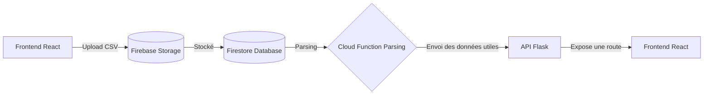

# Stock Master Pro
## **Présentation Générale**

L’application vise à **réduire le gaspillage des produits périssables** (lait, légumes, viandes) dans la grande distribution au Sénégal, en utilisant l’**intelligence artificielle** (réseaux de neurones LSTM). Elle permet aux gestionnaires de :

- **Prédire la demande hebdomadaire** avec précision.  
- **Optimiser les commandes** de stocks pour éviter le surstockage.  
- **Gérer les dates de péremption** via des alertes intelligentes.

**Aperçu et description des données d’entrainement :** 

### **Données d'entraînement**

| date       | produit      | categorie  | prix_vente | demande_journaliere | quantite_vendue | ventes_perdues | stock_initial | duree_peremption | temperature | promotion | jour_semaine | weekend | evenement | chiffre_affaires |
|------------|-------------|------------|------------|----------------------|-----------------|---------------|---------------|------------------|-------------|-----------|--------------|---------|-----------|----------------|
| 2022-01-01 | Lait_1L     | Laitage    | 1219       | 197                  | 101             | 96            | 101           | 7                | 31.66       | 0         | Saturday     | 1       | Aucun     | 123119         |
| 2022-01-01 | Yaourt      | Laitage    | 500        | 305                  | 100             | 205           | 100           | 5                | 36.62       | 0         | Saturday     | 1       | Aucun     | 50000          |
| 2022-01-01 | Tomates_kg  | Légumes    | 267        | 217                  | 119             | 98            | 119           | 5                | 32.88       | 0         | Saturday     | 1       | Aucun     | 31773          |
| 2022-01-01 | Oignons_kg  | Légumes    | 689        | 182                  | 90              | 92            | 90            | 10               | 35.33       | 0         | Saturday     | 1       | Aucun     | 62010          |

### **Description des colonnes**

| Colonne             | Type     | Description |
|---------------------|----------|-------------|
| date               | string   | Date au format YYYY-MM-DD |
| produit            | string   | Nom du produit (10 produits disponibles) |
| categorie          | string   | Catégorie du produit (Laitage/Légumes/Fruits/Viandes/Poissons/Epicerie) |
| prix_vente        | integer  | Prix de vente en FCFA (ajusté selon les événements) |
| demande_journaliere | integer  | Demande client estimée (loi de Poisson avec variations) |
| quantite_vendue    | integer  | Quantité réellement vendue (min(demande_journaliere; stock_initial)) |
| ventes_perdues     | integer  | Demande non satisfaite (demande_journaliere - quantite_vendue) |
| stock_initial      | integer  | Stock disponible en début de journée |
| duree_peremption   | integer  | Durée de péremption en jours (spécifique au produit) |
| temperature        | float    | Température maximale quotidienne à Dakar (°C) |
| promotion         | integer  | Indicateur de promotion (0=non; 1=oui) |
| jour_semaine      | string   | Nom du jour en français (ex: Lundi) |
| weekend           | integer  | Indicateur weekend (1=weekend; 0=jour ouvré) |
| evenement         | string   | Événement en cours (Ramadan/Aid_el_Fitr/Tabaski/Tabaski_JourJ/Aucun) |
| chiffre_affaires  | integer  | Chiffre d'affaires journalier (quantite_vendue × prix_vente) |

**Public cible** :

- Supermarchés, épiceries, et distributeurs alimentaires au Sénégal.  
- Responsables logistiques et gestionnaires de stocks.

